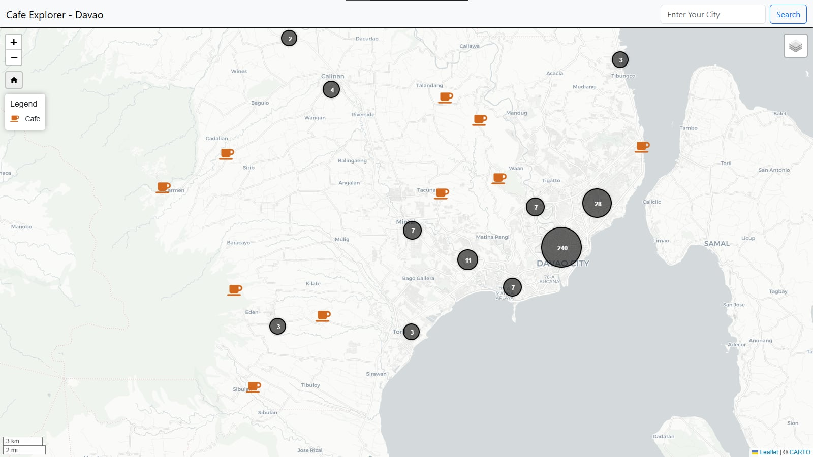

## 📖 About
This is a django project that uses OSM searcher to have a cafe as points

## Screenshot

## ✨ Features
List some key features:
- Search cafes by city
- View amenities with Leaflet map

## ⚙️ Installation
# Move into the directory
cd 05-searchplace02

# Run it
python manage.py runserver